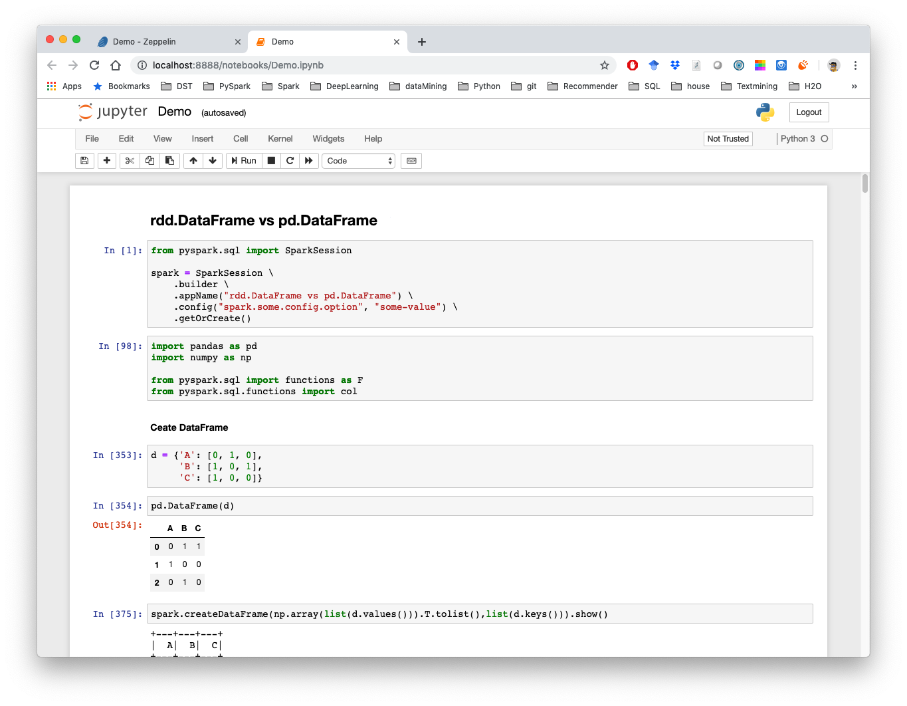

.. _nb:

=========
Notebooks 
=========

.. |nb| replace:: ``Jupyter Notebook``
.. |zp| replace:: ``Zeppelin``
.. |py| replace:: ``Python``

.. note::

	This Chapter :ref:`nb` is for beginner.  If you have some |py| programming experience, you may skip this chapter.

Apache Zeppelin
+++++++++++++++

The |zp| (Apache Zeppelin) is an open-source Web-based notebook that enables data-driven, 
interactive data analytics and collaborative documents with |py|, ``PySpark``, ``SQL``, ``Scala`` and more.

.. _fig_zep:
.. figure:: images/zep.png
	

Jupyter Notebook
++++++++++++++++

The |nb| (Ipython Notebook) is an open-source web application that allows you to create and share documents that contain ``live code``, ``equations``, ``visualizations`` and ``narrative text``. Uses include: data cleaning and transformation, numerical simulation, statistical modeling, data visualization, machine learning, and much more.

.. _fig_ipynb:
